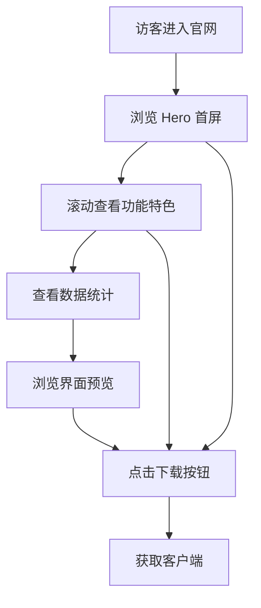

# 九语官网 - 产品需求文档

## 1. 产品概述

九语是一款 AI 聊天桌面应用（Electron），支持多模型接入、AI 人设定制、多会话管理等功能。本项目为九语创建官方品牌网站，用于展示产品特色、引导用户下载、建立品牌认知。

- **目标用户**：日常使用 AI 助手的普通用户、希望自定义 AI 人设的进阶用户
- **产品价值**：让用户了解九语的独特能力（人设精调、多模型、本地隐私），并方便地获取客户端

## 2. 核心功能

### 2.1 功能模块

1. **导航栏**：品牌 Logo、导航链接（首页、功能、下载、关于）、下载 CTA 按钮
2. **Hero 首屏**：产品标题、核心标语、主要 CTA（下载/了解更多）、视觉效果
3. **产品特色区**：6 大核心功能卡片展示
4. **数据展示区**：统计数字（支持模型数、功能特性数等）滚动计数动画
5. **界面预览区**：应用截图或界面展示
6. **CTA 下载区**：下载引导，平台选择
7. **页脚**：品牌信息、链接、版权声明

### 2.2 页面详情

| 区域 | 模块 | 功能描述 |
|------|------|---------|
| Hero | 首屏横幅 | 大标题 "九语"，副标题 "你的专属 AI 伙伴"，CTA 按钮，动态背景渐变 |
| 特色 | 功能卡片 | 6 张卡片：多模型支持、人设精调、多会话管理、本地数据安全、Markdown 渲染、深色模式 |
| 数据 | 统计数字 | 支持 30+ 模型、10+ 服务商、无限会话、纯本地存储 等数字滚动动画 |
| 预览 | 界面展示 | 应用截图轮播或静态展示，突出聊天界面、设置面板等 |
| 下载 | 下载引导 | Windows/macOS 下载入口，版本号，系统要求 |
| 页脚 | 品牌信息 | Logo、简介、链接、联系方式、版权 |

## 3. 核心流程

## 4. 用户界面设计

### 4.1 设计风格

- **主色调**：深空蓝黑 (#0a0e1a) 为底色，科技蓝渐变 (#4facfe → #00f2fe) 为强调
- **辅助色**：白色文字、半透明玻璃态卡片
- **字体**：默认系统中文字体（PingFang SC / Microsoft YaHei），标题加粗
- **布局**：单页面滚动，全宽区块交替，卡片式功能展示
- **风格定位**：现代科技感、简洁大气、专业可信赖
- **参考风格**：南孚官网的企业级视觉语言——全宽 Hero、卡片网格、数字统计、清晰 CTA

### 4.2 页面设计概览

| 区域 | 模块 | UI 元素 |
|------|------|--------|
| 导航栏 | 顶部导航 | 固定顶部，透明→深色渐变，Logo + 链接 + 下载按钮 |
| Hero | 首屏 | 全屏高度，动态渐变背景，大标题，副标题，双 CTA 按钮，向下滚动提示 |
| 特色 | 功能卡片 | 3列网格，玻璃态卡片，图标+标题+描述，悬停上浮效果 |
| 数据 | 统计 | 5列数字展示，大号数字+计数动画+标签 |
| 预览 | 界面图 | 居中大图，两侧装饰元素，淡入动画 |
| 下载 | CTA | 深色背景，居中标题+描述+下载按钮组，版本信息 |
| 页脚 | 信息 | 多列布局，品牌信息+链接+版权 |

### 4.3 响应式设计

- 桌面端优先设计（1920px / 1440px / 1024px 断点）
- 移动端自适应：导航折叠为汉堡菜单，卡片变为单列

### 4.4 动效

- 滚动触发淡入上浮动画（Intersection Observer）
- 数字计数滚动动画
- 卡片悬停上浮 + 光效
- CTA 按钮脉冲呼吸效果
- 导航栏滚动变色
