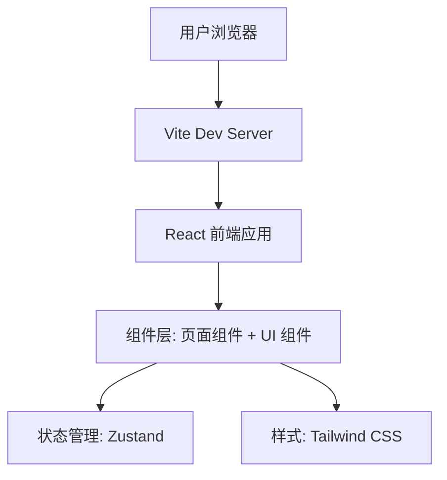

# 九语官网 - 技术架构文档

## 1. 架构设计



纯前端静态官网，无需后端服务。

## 2. 技术选型

- **前端框架**：React@18 + TypeScript
- **样式方案**：Tailwind CSS@3
- **状态管理**：Zustand（用于动画状态/滚动状态）
- **构建工具**：Vite
- **图标库**：lucide-react
- **初始化模板**：react-ts (vite-init)

## 3. 路由定义

| 路由 | 用途 |
|------|------|
| / | 首页（单页全内容） |

本项目为单页面应用，所有内容在一个路由中通过锚点导航。

## 4. 组件结构

```
src/
├── components/
│   ├── Navbar.tsx          # 顶部导航栏
│   ├── Hero.tsx            # 首屏区域
│   ├── Features.tsx        # 功能特色卡片
│   ├── Stats.tsx           # 数据统计
│   ├── Preview.tsx         # 界面预览
│   ├── Download.tsx        # 下载引导
│   ├── Footer.tsx          # 页脚
│   ├── CountUp.tsx         # 数字滚动动画组件
│   └── ScrollReveal.tsx    # 滚动触发动画包装组件
├── hooks/
│   └── useScrollReveal.ts  # 滚动可见性检测 hook
├── pages/
│   └── Home.tsx            # 首页（组合所有区块）
├── App.tsx                 # 根组件
├── main.tsx                # 入口
└── index.css               # 全局样式 + Tailwind 指令
```

## 5. 无后端

本官网为纯静态站点，无需 API 和数据库。所有内容为静态数据，直接硬编码在组件中。
